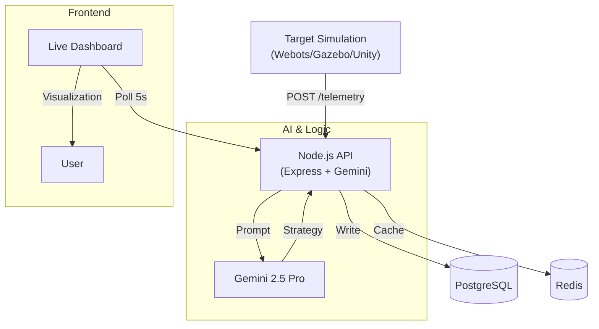

# 🤖 ARCC — Autonomous Robotics Command Center

**A Digital Twin Platform for Simulating, Optimizing, and Managing Autonomous Robot Fleets.**

> *"What if you could test 1,000 robot configurations in software before deploying a single unit in the real world?"*

[](http://149.28.125.185:3000)
[](https://nodejs.org/)
[](https://www.postgresql.org/)
[](https://deepmind.google/technologies/gemini/)

---

## 🚀 Live Demo
**👉 [Access the Command Center](http://149.28.125.185:3000)**

*No login required for guest access. Watch the fleet in action!*

---

## 🎯 The Problem
Deploying autonomous robots is **expensive and risky**. A single misconfiguration can cost $50K+ in damaged equipment. Companies today deploy blindly, hoping their algorithms work in the real world.

## 💡 The Solution
**ARCC** is a centralized command center that bridges **simulation** and **metrics**. It acts as a "flight recorder" and "traffic controller" for your robot fleet, powered by **Google's Gemini 2.5 Pro** model.

### Key Capabilities
1.  **🏭 Multi-Warehouse Management**: Track robots across different physical locations (San Francisco, Austin, Berlin).
2.  **🧠 AI Optimization**: Gemini 2.5 Pro analyzes telemetry to assign tasks and optimize routes in real-time.
3.  **⚡ God Mode**: Inject chaos (blocked paths, battery failures, demand spikes) to stress-test your fleet.
4.  **🔄 Self-Improvement Loop**: The system learns from every simulation run, generating better strategies automatically.
5.  **🔌 Universal Bridge**: Connect **Webots**, **Gazebo**, or **Unity** simulations via a simple REST API.

---

## 🏗 Architecture



---

## 🛠 Tech Stack

| Component | Technology | Description |
|-----------|-----------|-------------|
| **Core** | Node.js + Express.js | High-performance event-driven backend |
| **Database** | PostgreSQL 15 | relational data for runs, robots, tasks, metrics |
| **Caching** | Redis 7 | Sub-millisecond telemetry ingestion |
| **AI Model** | **Gemini 2.5 Pro** | Decision making, strategy generation, log analysis |
| **Frontend** | Vanilla JS + Canvas | Lightweight, dependency-free dashboard |
| **Infrastructure** | Vultr Cloud | Ubuntu 22.04 LTS VPS hosting |
| **Simulation** | Webots / PythonBridge | External physics engine integration |

---

## 🔌 Simulation Integration (Python)

Connect ANY robot simulation to ARCC using our lightweight Python bridge.

```python
import requests

# 1. Connect
API_URL = "http://149.28.125.185:3000/api"

# 2. Send Telemetry in your update loop
requests.post(f"{API_URL}/telemetry/{run_id}", json={
    "robot_id": "ROBOT_01",
    "x": 45.2, "y": 12.8,
    "battery": 88.5,
    "status": "working"
})
```
*See `UPDATED_CONTROLLER.py` for a full Webots example.*

---

## 🚀 Quick Start (Local Dev)

### Prerequisites
- Node.js 18+
- Docker & Docker Compose

### 1. Clone & Setup
```bash
git clone https://github.com/let-the-dreamers-rise/autonomous-robotics-command-center.git
cd autonomous-robotics-command-center
npm install
```

### 2. Start Infrastructure
```bash
docker compose up -d
```

### 3. Initialize Database
```bash
# Copy init script to container and run it
docker cp init_db.sql robotics-backend-db-1:/init_db.sql
docker exec -i robotics-backend-db-1 psql -U admin -d robotics_v1 -f /init_db.sql
```

### 4. Run the Server
```bash
# Create .env file with your GEMINI_API_KEY first!
node server.js
```

Visit **`http://localhost:3000`** to see your local instance!

---

## 📡 API Endpoints

| Method | Endpoint | Purpose |
|--------|----------|---------|
| `GET` | `/api/metrics/dashboard` | Main dashboard aggregate stats |
| `GET` | `/api/warehouses` | List warehouses & status |
| `POST` | `/api/simulations/start` | Begin a new simulation run |
| `POST` | `/api/telemetry/:run_id` | Ingest high-freq robot data |
| `POST` | `/api/ai/optimize/:run_id` | Trigger Gemini optimization |
| `POST` | `/api/scenarios/trigger` | Inject "God Mode" disruption |

---


